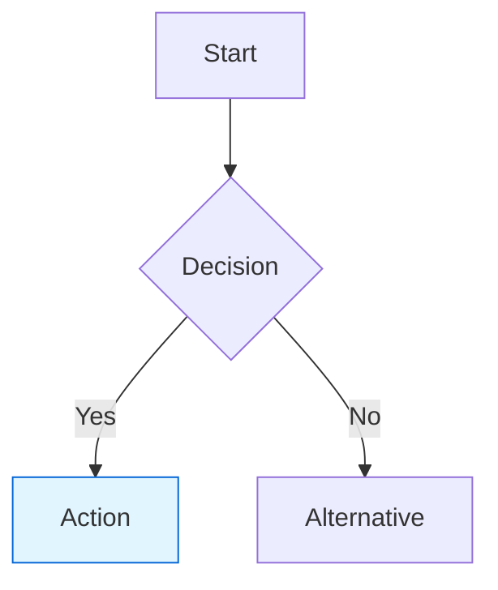

# README Documentation Instructions

This file provides GitHub Copilot with standards and patterns for maintaining the repository's README documentation.

---

## Documentation Principles

**Purpose:** The README serves as the primary entry point for understanding this repository. It should enable new users to:
- Understand the project's purpose and architecture
- Get started quickly with clear examples
- Navigate to detailed resources for deeper understanding
- Understand the operational workflows (testing, deployment)

**Target Audience:**
- Developers learning data-driven Terraform patterns
- Workshop participants following hands-on exercises
- Operations teams deploying and maintaining infrastructure
- Contributors adding new features or modules

---

## README Structure

### Required Sections (in order)

1. **Title and Badges**
   - Repository name with clear project identification
   - Status badges for CI/CD, license, Terraform version
   - Keep visual elements minimal and relevant

2. **Project Overview**
   - Brief (2-3 sentence) description of what this repository demonstrates
   - Clear statement of the architectural pattern being used
   - Link to relevant background concepts or documentation

3. **Table of Contents**
   - Auto-generated or manually maintained
   - Should include subsections for complex topics (e.g., "Usage Example" with child items)
   - Use relative anchor links (`#section-name`)

4. **Architecture**
   - High-level explanation of the data-driven Terraform pattern
   - Three-layer architecture description (Data → Infrastructure → Instantiation)
   - Mermaid diagram showing layer relationships
   - File tree showing directory structure with annotations

5. **Workflow/Pipeline Explanation**
   - Description of what the infrastructure actually does
   - Mermaid flowchart showing data flow (e.g., ETL pipeline)
   - Clear identification of trigger points and processing stages

6. **Usage Example**
   - Step-by-step walkthrough of common tasks
   - Subsections for: Adding buckets, Adding Lambdas, Adding notifications, etc.
   - Include actual code snippets from the repository
   - Show both the data definition AND the result

7. **Prerequisites**
   - Required tools and versions (Terraform, AWS CLI, Python, etc.)
   - Required AWS permissions
   - Environment setup (AWS credentials, roles, S3 backend)

8. **Testing Locally**
   - Commands for initialization, validation, planning
   - Expected outputs and how to interpret them
   - Common troubleshooting tips

9. **Deployment**
   - CI/CD workflow explanation
   - Manual deployment instructions if applicable
   - Approval gates and security considerations

10. **Project Structure**
    - Detailed explanation of each directory
    - Purpose of key files
    - Relationships between components

11. **Adding Infrastructure**
    - Specific guides for each resource type
    - Template code snippets
    - Validation steps after making changes

12. **Contributing** (if open source)
    - Guidelines for contributions
    - Code style requirements
    - PR process

13. **License**
    - License type and link to full text

---

## Content Guidelines

### Writing Style

- **Clarity over cleverness:** Use simple, direct language
- **Active voice:** "You add buckets..." not "Buckets are added..."
- **Imperative for instructions:** "Run `terraform init`" not "You should run terraform init"
- **Present tense for descriptions:** "The module creates..." not "The module will create..."

### Code Examples

**Always include:**
- Syntax highlighting (specify language: ```terraform, ```bash, ```python)
- Comments explaining non-obvious parts
- Full context (don't use `...` for omitted code unless clearly marked)
- Expected output after code execution when relevant

**Format:**
```terraform
# Good: Full context with explanation
# In modules/data/buckets.tf
{
  name         = "landing"
  folder_paths = []  # No pre-created folders needed
}
```

```terraform
# Bad: Lacks context and explanation
{
  name = "landing"
}
```

### Diagrams

**Use Mermaid for:**
- Architecture diagrams (flowchart, graph)
- Data flow diagrams (flowchart with subgraphs)
- Infrastructure relationships (graph)

**Mermaid best practices:**
- Use consistent styling (`classDef` for colors)
- Keep diagrams focused (one concept per diagram)
- Add legends if using color coding
- Use subgraphs to show logical groupings

**Example structure:**


### Links

**Linking standards:**
- Use relative links for internal files: `[file](./path/to/file.tf)`
- Use descriptive link text: `[S3 bucket module](./modules/infrastructure/s3/)` not `[click here](./modules/infrastructure/s3/)`
- Link to specific line ranges when referencing code: `[Lambda definition](./modules/data/lambdas.tf#L15-L25)`
- External links should open in new context where appropriate (handled by viewer)

### File Trees

**Use for showing structure:**
```
modules/
├── data/                    # Data structure definitions
│   ├── buckets.tf          # S3 bucket configurations
│   ├── lambdas.tf          # Lambda function definitions
│   └── infrastructure.tf   # Data enrichment logic
├── infrastructure/          # Reusable resource modules
│   ├── s3/                 # S3 bucket module
│   └── lambda/             # Lambda function module
└── ...
```

**Rules:**
- Use tree characters (├── └──) for visual clarity
- Add inline comments for non-obvious directories
- Keep depth reasonable (3-4 levels max in one tree)
- Group related items together

---

## Updating the README

### When to Update

**Required updates:**
- New infrastructure resource types added to `modules/data/`
- New infrastructure modules created in `modules/infrastructure/`
- Changes to the deployment workflow or CI/CD
- Architecture pattern changes
- Breaking changes to usage patterns

**Consider updating:**
- Adding helpful troubleshooting tips based on common issues
- Improving examples based on user feedback
- Clarifying ambiguous sections
- Adding diagrams for complex concepts

### Making Changes

**Process:**
1. Identify which section(s) need updating
2. Update content following the style guide
3. Verify all links still work
4. Check Mermaid diagrams render correctly
5. Update Table of Contents if structure changed
6. Test code examples if included
7. Run any linters/formatters if configured

**Common patterns:**

Adding a new resource type example:
1. Update "Adding Infrastructure" section with new subsection
2. Update "Quick Reference" or similar section with template
3. Update architecture diagram if it affects data flow
4. Add to Table of Contents

Updating workflow:
1. Update Mermaid flowchart diagram
2. Update text description of workflow
3. Update "Usage Example" if workflow changed user interaction
4. Check "Testing Locally" section for relevance

---

## Repository-Specific Context

### This Repository's Focus

**Primary purpose:** Demonstrate data-driven Terraform through an ETL pipeline example

**Key concepts to emphasize:**
- Infrastructure as data structures (not imperative resource blocks)
- Three-layer separation (data, modules, instantiation)
- Cross-reference resolution through enrichment
- Type safety with `list(object({...}))` patterns

### Current ETL Pipeline

The README should clearly explain:
- Landing bucket receives ZIP files
- Unzip processor extracts CSV files to raw bucket
- Parquet converter transforms CSV to Parquet in processed bucket
- S3 notifications trigger Lambda functions

### Consistency Requirements

**Naming in examples:**
- Always use `aws-sudoblark-development` for account
- Always use `demos` for project
- Always use `tf-micro-repo` for application
- Show full resource names in AWS (with prefix) but short names in data definitions

**Code snippets:**
- Terraform examples should be valid and executable
- Python Lambda code should follow Black formatting
- Bash commands should be copy-pasteable

---

## Maintenance Notes

### Avoid These Patterns

- Don't include implementation details that should be in code comments
- Don't duplicate content that exists in other docs (link instead)
- Don't include sensitive information (account IDs, ARNs with account info)
- Don't use screenshots for content that can be text/code (accessibility)
- Don't make claims about future features (use "may" not "will")

### Keep Updated

- Terraform version requirements in Prerequisites
- CI/CD workflow descriptions if changed
- Module capabilities if new features added
- Contact information or links to external resources

---

**Remember:** The README is often the first impression of this repository. Invest in making it clear, accurate, and helpful.
