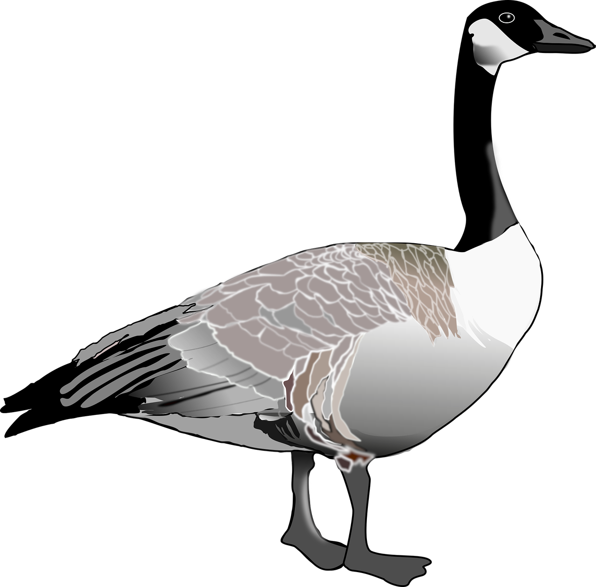

<!-- PROJECT LOGO -->
<br />
<div align="center">
  <a href="https://github.com/sudoblark/sudoblark.terraform.modularised-demo">
    
  </a>

<h3 align="center">sudoblark.terraform.modularised-demo</h3>

  <p align="center">
    An example Terraform setup using modularised components to fulfill a use-case - repo managed by sudoblark.terraform.github
    <br />
  </p>
</div>


<!-- TABLE OF CONTENTS -->
<details>
  <summary>Table of Contents</summary>
  <ol>
    <li>
      <a href="#about-the-project">About The Project</a>
      <ul>
        <li><a href="#built-with">Built With</a></li>
          <ul>
            <li><a href="#infrastructure">Infrastructure</a></li>
            <li><a href="#application-code">Application code</a></li>
          </ul>
      </ul>
    </li>
    <li>
      <a href="#getting-started">Getting Started</a>
      <ul>
        <li><a href="#prerequisites">Prerequisites</a></li>
        <li><a href="#pre-commit-hooks">Pre-commit hooks</a></li>
      </ul>
    </li>
    <li>
      <a href="#usage">Usage</a>
      <ul>
        <li><a href="#deploying-terraform">Deploying Terraform</a></li>
        <li><a href="#processing-dummy-files">Processing dummy files</a></li>
      </ul>
    </li>
  </ol>
</details>


<!-- ABOUT THE PROJECT -->
## About The Project

This repo is simply a demo of how a modularised terraform setup may be utilised
in a micro-repo fashion - i.e. one repo per business-case.

It's counter may be considered to be [sudoblark.terraform.github](https://github.com/sudoblark/sudoblark.terraform.github)
, which is an example mono-repo to manage all aspects of a single SaaS product in one place.

For now, the repo is intended to be used in workshops/conferences to demonstrate a data-structure driven approach
to Terraform - and as such the underlying modules are private, so cannot be initialised by anyone
outside of Sudoblark.

<p align="right">(<a href="#readme-top">back to top</a>)</p>


### Built With

#### Infrastructure
* [Terraform v1.5.1](https://github.com/hashicorp/terraform/releases/tag/v1.5.1)
* [tfenv](https://github.com/tfutils/tfenv)
* [awscli](https://aws.amazon.com/cli/)

#### Application code
* [Python 3.10](https://peps.python.org/pep-0619/)
* [Black](https://black.readthedocs.io/en/stable/)
* [Flake8](https://flake8.pycqa.org/en/latest/index.html)

<p align="right">(<a href="#readme-top">back to top</a>)</p>


<!-- GETTING STARTED -->
## Getting Started

Below we outlined how to interact with both Infrastructure and Application code bases.

The repo structure is relatively simple:

- `application` is the top-level for app code. Subfolders in here should be made
such that Python apps following their respective best-practices, and we
have a single source of truth for state machine JSON etc.
- `infrastructure` contains both:
  - `example-account` folders, one per account, which instantiate modules
  - `modules` folder to act as a top-level for re-usable Terraform modules

This repo is intended to be used for demonstration purposes when delivering
conferences, but is also made public such that conference attendees may
query it in their own time as well.

### Prerequisites

Note: Below instructions are for MacOS only, alteration may be required
to get this working on other operating systems.

* tfenv
```sh
git clone https://github.com/tfutils/tfenv.git ~/.tfenv
echo 'export PATH="$HOME/.tfenv/bin:$PATH"' >> ~/.bash_profile
```

* awscli
```sh
curl "https://awscli.amazonaws.com/awscli-exe-linux-x86_64.zip" -o "awscliv2.zip"
unzip awscliv2.zip
./aws/install
```

* Virtual environment with pre-commit installed

```sh
python3 -m venv venv
source venv/bin/activate
pip install pre-commit
```

* Poetry
```sh
pip install -U pip setuptools
pip install poetry
```

### Pre-commit hooks
Various pre-commit hooks are in place in order to ensure consistency across the codebases.

You may run these yourself as follows:

```sh
source venv/bin/activate
pip install pre-commit
pre-commit run --all-files
```

<p align="right">(<a href="#readme-top">back to top</a>)</p>

<!-- USAGE EXAMPLES -->
## Usage

Below we will outline intended use-cases for the repository.

Note: This section assumes you've installed pre-requisites as
per above.

### Deploying Terraform

The `main.tf` file in `example-account` is left deliberately blank, such
that this may be instantiated in any AWS Infrastructure required for
demonstration or learning purposes.

Simply:

1. Navigate to the instantiation folder:

```sh
cd infrastructure/example-account
```

2. Ensure your shell is authenticated to an appropriate profile for AWS

```sh
export AWS_DEFAULT_PROFILE=<PROFILE-NAME>
```

3. For now, access to the Sudoblark GitHub org is required for the underlying modules,
so you'll need to use a GITHUB_TOKEN to download these modules:

```sh
export GITHUB_TOKEN=<TOKEN>
```

4. ZIP the lambda (Note in a production environment this would usually be done via CI/CD)

```sh
cd application/unzip-lambda/unzip_lambda
zip -r lambda.zip lambda_function.py
mkdir src
mv lambda.zip src
```

4. Init, plan and then apply.

```sh
terraform init
terraform plan
terraform apply
```

4. Simply tear-down when required

```sh
terraform destroy
```

### Processing dummy files
Files under `application/dummy_uploads` contain the contents of the ZIP file our unzip lambda
unzips from the `raw` to `processed` bucket.

Files names are in the format: `YYYYmmdd.csv` Each file corresponds to dogs viewed that day, with rows
being in the format of:

```
dog_name, breed, location
```
For example, we may have a file named 20241008.csv with a single row:

```
Cerberus, Molossus, Hades
```

Thus indicating that on the 08th October 2024, we spotted Cerberus doing a valiant job guarding the gates to Hates.

To upload these dummy files after the solution has been deployed in to AWS:

1. First ZIP the files:

```sh
cd application/dummy_uploads
zip -r uploads.zip .
```

2. Then, upload the ZIP to the `dev-raw` bucket at the `dogs/landing` prefix.
3. This should then trigger an s3 bucket notification to run the lambda:

4. This lambda, in turn, should unzip the files and re-upload them into the `dev-processed` bucket,
at the `dogs/daily` root with prefix determined by date. i.e. for 20241008.csv we'd expect
an upload at `dogs/daily/_year=2024/_month=10/_day=08/viewings`

<p align="right">(<a href="#readme-top">back to top</a>)</p>