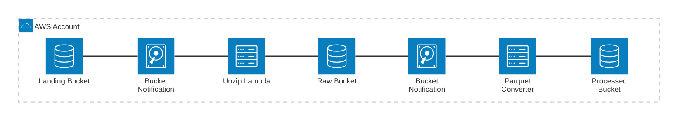
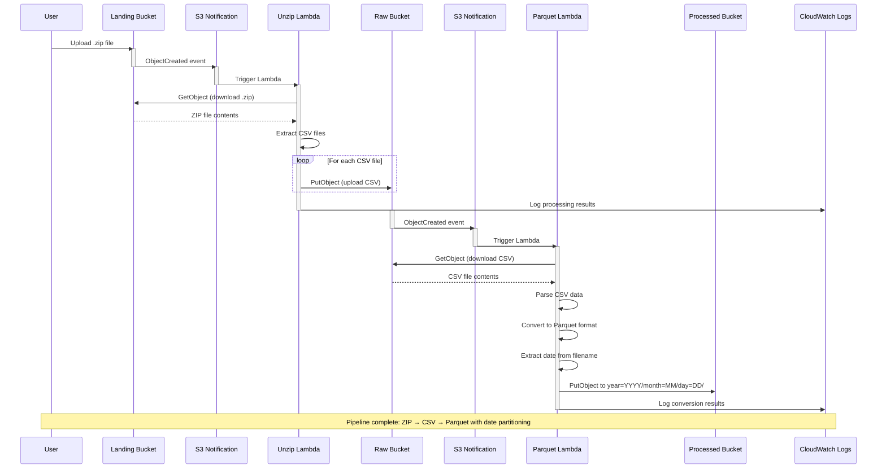

<!-- PROJECT LOGO -->
<br />
<div align="center">

<h3 align="center">sudoblark.terraform.modularised-demo</h3>

  <p align="center">
    A data-driven Terraform demonstration showcasing modularised infrastructure patterns for AWS - creating S3 buckets, Lambda functions, and event-driven processing pipelines through declarative configuration.
  </p>
  <p align="center">
    <a href="https://github.com/sudoblark/sudoblark.terraform.modularised-demo/actions/workflows/commit-to-pr.yaml">
      
    </a>
    <a href="https://github.com/sudoblark/sudoblark.terraform.modularised-demo/actions/workflows/deploy.yaml">
      
    </a>
  </p>

</div>

<!-- TABLE OF CONTENTS -->
<details>
  <summary>Table of Contents</summary>
  <ol>
    <li><a href="#sudoblark-terraform-modularised-demo">sudoblark.terraform.modularised-demo</a></li>
    <li><a href="#architecture">Architecture</a></li>
    <li><a href="#adding-new-infrastructure">Adding New Infrastructure</a>
      <ul>
        <li><a href="#adding-s3-buckets">Adding S3 Buckets</a></li>
        <li><a href="#adding-lambda-functions">Adding Lambda Functions</a></li>
        <li><a href="#configuring-s3-notifications">Configuring S3 Notifications</a></li>
      </ul>
    </li>
    <li>
      <a href="#developer-documentation">Developer Documentation</a>
      <ul>
        <li><a href="#prerequisites">Prerequisites</a></li>
        <li><a href="#configuration">Configuration</a></li>
        <li><a href="#pre-commit-hooks">Pre-commit hooks</a></li>
      </ul>
    </li>
    <li><a href="#cicd">CI/CD</a></li>
    <li><a href="#usage-example">Usage Example</a>
      <ul>
        <li><a href="#deploying-the-example">Deploying the Example</a></li>
        <li><a href="#testing-the-pipeline">Testing the Pipeline</a></li>
      </ul>
    </li>
    <li><a href="#license">License</a></li>
  </ol>
</details>

# sudoblark.terraform.modularised-demo
Build AWS infrastructure with data-driven Terraform patterns!

## Architecture

This repository demonstrates a modularised, data-driven approach to Terraform infrastructure management. Instead of writing repetitive resource blocks, you define infrastructure in simple data structures that are automatically transformed into AWS resources.

**Core Components:**

- **`modules/data/`** - Data-driven configuration layer
  - [buckets.tf](modules/data/buckets.tf) - S3 bucket definitions with folder structures
  - [lambdas.tf](modules/data/lambdas.tf) - Lambda function configurations
  - [notifications.tf](modules/data/notifications.tf) - S3 event notification mappings
  - [defaults.tf](modules/data/defaults.tf) - Default values and common configuration
  - [infrastructure.tf](modules/data/infrastructure.tf) - Data enrichment and cross-reference resolution
  - [outputs.tf](modules/data/outputs.tf) - Processed data for infrastructure modules

- **`modules/infrastructure/`** - Reusable infrastructure modules
  - [s3/](modules/infrastructure/s3/) - S3 bucket creation with optional folder pre-creation
  - [lambda/](modules/infrastructure/lambda/) - Lambda function deployment from ZIP files
  - [s3-notifications/](modules/infrastructure/s3-notifications/) - S3 bucket event notifications to Lambda

- **`infrastructure/aws-sudoblark-development/`** - Environment-specific instantiation
  - Consumes the data module
  - Creates actual AWS resources using infrastructure modules
  - Manages state and provider configuration

**How It Works:**

1. **Data Definition** (`modules/data/`):
   - Define infrastructure in simple Terraform local values
   - Specify buckets, Lambdas, and their relationships
   - Configuration files include comprehensive docstrings with examples

2. **Data Enrichment** (`modules/data/infrastructure.tf`):
   - Automatically computes full resource names following naming conventions
   - Merges specific configurations with defaults
   - Resolves cross-references (bucket names → ARNs, Lambda names → ARNs)
   - Creates lookup maps for easy access

3. **Infrastructure Creation** (`infrastructure/aws-sudoblark-development/`):
   - Iterates over enriched data structures
   - Passes resolved configurations to infrastructure modules
   - Infrastructure modules create actual AWS resources

4. **Event-Driven Processing**:
   - S3 buckets trigger Lambda functions on file uploads
   - Notification configurations link buckets and Lambdas declaratively
   - Example: ZIP file processing pipeline with automatic partitioning

**Key Benefits:**

- **Declarative**: Define "what" you want, not "how" to create it
- **DRY Principle**: Write configuration once, reuse across resources
- **Consistency**: Automatic naming conventions and tagging
- **Scalability**: Add new resources by adding data entries, not code
- **Maintainability**: Clear separation between data and logic

## Adding New Infrastructure

All infrastructure changes are made by updating data structures in `modules/data/`. The Terraform code automatically processes these definitions and creates the corresponding AWS resources.

### Adding S3 Buckets

Update [modules/data/buckets.tf](modules/data/buckets.tf) to add new S3 buckets:

```hcl
# modules/data/buckets.tf
{
  name         = "analytics"
  folder_paths = ["reports", "archive"]
}
```

The bucket will automatically:
- Be named `account-project-application-analytics` (all lowercase)
- Pre-create the specified folder paths
- Include default tags

### Adding Lambda Functions

Update [modules/data/lambdas.tf](modules/data/lambdas.tf) to add new Lambda functions:

```hcl
# modules/data/lambdas.tf
{
  name             = "data-validator"
  description      = "Validates incoming data files"
  zip_file_path    = "../../lambda-packages/data-validator.zip"
  handler          = "validator.handler"
  runtime          = "python3.11"
  timeout          = 120
  memory_size      = 1024
  role_name        = "data-validator-role"
  environment_variables = {
    VALIDATION_RULES = "strict"
    LOG_LEVEL        = "DEBUG"
  }
}
```

The Lambda will automatically:
- Be named `account-project-application-data-validator`
- Have its role ARN resolved from `role_name`
- Merge with defaults for unspecified values
- Include default tags

### Configuring S3 Notifications

Update [modules/data/notifications.tf](modules/data/notifications.tf) to link buckets with Lambda functions:

```hcl
# modules/data/notifications.tf
{
  bucket_name = "analytics"
  lambda_notifications = [
    {
      lambda_name   = "data-validator"
      events        = ["s3:ObjectCreated:Put"]
      filter_prefix = "reports/"
      filter_suffix = ".json"
    }
  ]
}
```

The notification will automatically:
- Resolve bucket and Lambda ARNs from names
- Configure S3 event triggers
- Apply event filters for specific file patterns

**Configuration Pattern:**
- Each data file has comprehensive docstrings explaining structure and constraints
- All cross-references are resolved automatically
- Defaults are merged intelligently
- Naming conventions are applied consistently

## Developer Documentation

The below documentation is intended to assist a developer with interacting with the Terraform code in order to add, remove or update AWS infrastructure configurations.

All instructions, unless otherwise stated, are explicitly for MacOS.

### Prerequisites

* tfenv
```sh
git clone https://github.com/tfutils/tfenv.git ~/.tfenv
echo 'export PATH="$HOME/.tfenv/bin:$PATH"' >> ~/.bash_profile
```

* Virtual environment with pre-commit installed

```sh
python3 -m venv venv
source venv/bin/activate
pip install pre-commit
```

* AWS CLI configured with appropriate credentials
```sh
aws configure --profile sudoblark-development
```

### Configuration

1. Update [modules/data/buckets.tf](modules/data/buckets.tf) to define S3 buckets
2. Update [modules/data/lambdas.tf](modules/data/lambdas.tf) to define Lambda functions
3. Update [modules/data/notifications.tf](modules/data/notifications.tf) to configure event-driven processing
4. Update [modules/data/defaults.tf](modules/data/defaults.tf) to adjust default values (if needed)

All data files include comprehensive docstrings with field descriptions, constraints, and examples.

### Pre-commit hooks

This repository utilises pre-commit to ensure code quality on every commit. The hooks automatically format and validate code before it's committed.

Install and run with:

```sh
source venv/bin/activate
pip install pre-commit
pre-commit install
pre-commit run --all-files
```

**Pre-commit hooks include:**

- **Terraform formatting** - Ensures consistent Terraform code style
- **YAML linting** - Validates GitHub Actions workflows
- **General file fixes** - Trailing whitespace, end-of-file fixes, merge conflict detection

All formatting is automatic - the hooks will fix issues and re-run validation.

## CI/CD

This repository uses GitHub Actions for quality checks on pull requests:

- **Format Check** - Validates Terraform formatting
- **Validate** - Runs `terraform validate`
- **Checkov** - Security and best practices scanning
- **Test** - Runs `terraform test` (if applicable)
- **Plan** - Generates and displays terraform plan

All checks must pass before merging to main. On merge to main (with approval), Terraform apply runs automatically.

## Usage Example

This repository includes a complete working example of an event-driven file processing pipeline:

**Infrastructure Components:**



**Processing Workflow:**



### Deploying the Example

This repository uses dedicated CD pipelines for infrastructure lifecycle management, optimized for workshop and conference demonstrations.

**CD Pipelines:**

- **`.github/workflows/apply.yaml`** - Deploys infrastructure to development
  - Run before or during workshops/demos
  - Manual trigger with approval gates
  - Packages Lambda functions automatically
  - Deploys all infrastructure to `aws-sudoblark-development`

- **`.github/workflows/destroy.yaml`** - Tears down infrastructure
  - Run after workshops to save costs
  - Manual trigger with approval gates
  - Removes all deployed resources
  - Cleans up development environment

**Usage for Workshops:**

1. **Before/During Workshop:**
   - Trigger the `apply` workflow from GitHub Actions
   - Approve the deployment
   - Infrastructure is ready for demonstrations

2. **After Workshop:**
   - Trigger the `destroy` workflow from GitHub Actions
   - Approve the teardown
   - All resources are removed to avoid ongoing costs

### Testing the Pipeline

The `application/dummy_uploads/` directory contains sample CSV files named in the format `YYYYmmdd.csv`:

```csv
dog_name, breed, location
Cerberus, Molossus, Hades
```

**Upload test files:**

1. Create ZIP archive:

```sh
cd application/dummy_uploads
zip -r data.zip *.csv
```

2. Upload to landing bucket (triggers unzip Lambda):

```sh
aws s3 cp data.zip s3://aws-sudoblark-development-demos-tf-micro-repo-landing/
```

3. Verify files extracted to raw bucket:

```sh
aws s3 ls s3://aws-sudoblark-development-demos-tf-micro-repo-raw/ --recursive
```

4. Verify parquet files in processed bucket:

```sh
aws s3 ls s3://aws-sudoblark-development-demos-tf-micro-repo-processed/ --recursive
```

**Processing Flow:**

1. **Landing → Raw (Unzip Lambda)**:
   - Detects `.zip` file upload to landing bucket
   - Extracts individual CSV files
   - Uploads CSV files to raw bucket

2. **Raw → Processed (Parquet Converter)**:
   - Detects `.csv` file upload to raw bucket
   - Parses CSV content
   - Converts to Parquet format
   - Partitions by date from filename (YYYYmmdd format)
   - Uploads to `s3://processed/_year=YYYY/_month=MM/_day=DD/data.parquet`

**Pattern Demonstration:**

This example showcases:
- Data-driven infrastructure configuration
- Multi-stage event-driven serverless processing
- Automatic cross-resource linking (buckets → Lambda → notifications)
- Chained Lambda functions triggered by S3 events
- Data transformation pipeline (ZIP → CSV → Parquet)
- Consistent naming conventions
- Declarative infrastructure definitions

## License

See [LICENSE.txt](LICENSE.txt) for details.
